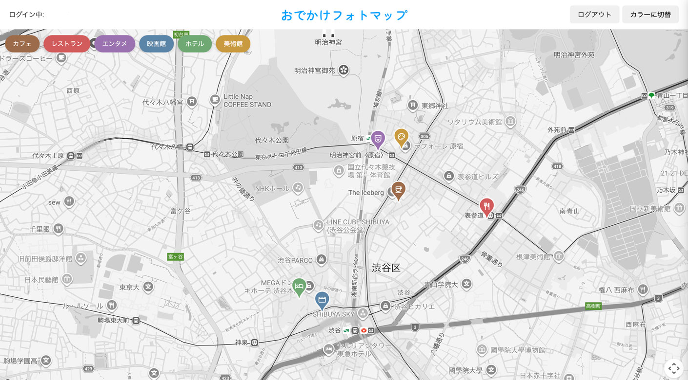

# ②課題内容（どんな作品か）

- 地図上の好きな場所にピンを立てて、写真とテキストでスポットを記録・共有できる地図アプリです。 投稿データは Firestore、画像は Firebase Storage に保存しています。

## ③アプリのデプロイURL

https://fir-map-2026gs.firebaseapp.com/

## ④アプリのログイン用IDまたはPassword（ある場合）

- Googleアカウントでログインできます（Firebase Authentication）。
- ID / PW: 各自のGoogleアカウント

## ⑤工夫した点・こだわった点

- スポットの投稿・編集画面に簡易的な「ブロックエディタ」を実装し、テキストと画像を好きな順番で組み合わせて記事を作れるようにしました（↑↓ボタンで並べ替え可能）。
- カテゴリ（カフェ・レストラン・エンタメ・映画館・ホテル・美術館）ごとにピンを色分けし、Google Fonts のアイコンを表示。カテゴリ単位で表示のON/OFFも切り替えられます。
- スポットの詳細は、PCでは右から、スマホでは下からスライドインするパネルで表示。1つのパネル内で「表示」と「編集」がそのまま切り替わるようにしました。
- 地図のスタイルをモノクロ⇔カラーでワンタップ切り替えできるようにしました。

## ⑥難しかった点・次回トライしたいこと（又は機能）

- Google Maps API の実装に苦労しました（地図に立てるピンの実装など、AIに相談しながら進めました）。
- Vite でのビルドや、GitHub Actions による自動デプロイにも初挑戦し、`git push` するだけでサイトが更新される仕組みを構築しました。
- Googleログインを、当初のポップアップ方式からリダイレクト方式に変更することに挑戦しました。リダイレクト方式はブラウザのサードパーティCookie制限の影響で動作させるのが難しく、ホスティング先を GitHub Pages から Firebase Hosting に移行することで実現できました。
- APIキーなどの秘密情報は `.env` で管理し、`.gitignore` で除外して GitHub には公開しないようにしました。本番デプロイ時は GitHub Secrets に登録し、GitHub Actions のビルド時に安全に読み込んでいます。
- 次回は、カテゴリの追加・削除や、スポットの検索機能を実装してみたいです。

## ⑦フリー項目（感想、シェアしたいこと等なんでも）

外出先で「あのカフェどこだっけ？」というような場面が多く、写真と一緒に地図上に記録できたら便利だな、と思って制作しました。
